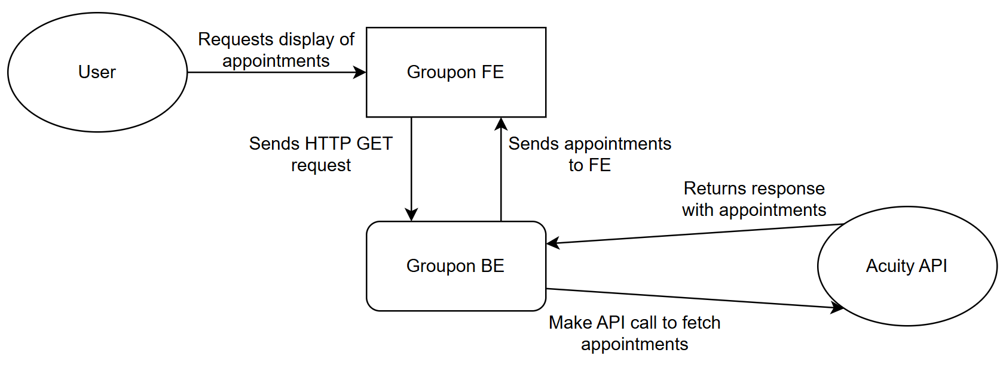

# groupon-case-study

## Overview
This repository provides a rough draft for integrating with a potential partner (Acuity Scheduling) via their REST API.  
The example code demonstrates how to fetch appointments, parse JSON responses into Java objects, and handle basic API interactions.  
All implementations can be adjusted based on the specific requirements of the project.

This diagram demonstrates the flow of data in Acuity Scheduling integration. When a user requests to view appointments 
through the frontend, it sends an HTTP GET request to backend services. The backend makes the appropriate API call to 
Acuity's REST endpoints. Acuity returns appointment data which our backend processes and forwards to the frontend for 
display to the user. 

## Steps to Integrate with Acuity
To integrate Acuity Scheduling with our system, we need to:

### **1. Obtain API Credentials**
- Register an account with Acuity Scheduling.
- Obtain an API Key from Acuity's developer portal.

### **2️. Identify Available API Endpoints**
Key API endpoints needed:
- **GET /appointments** - Retrieve booked appointments.
- **GET /availability/dates(times)** - Check available slots for a service.
- **POST /appointments** - Book a new appointment.

### **3️. Implement API Calls**
- Use RestTemplate to call API.
- Handle authentication using API keys.
- Parse JSON responses into Java objects using ObjectMapper.

### **4️. Store & Process Data**
- Save relevant appointment details.
- Convert response format to match database structure.

### **5️. Handle Edge Cases**
- Error Handling: Handle cases where a time slot is no longer available.

### Note
This case study was developed with the assistance of AI tools (ChatGPT, Claude).